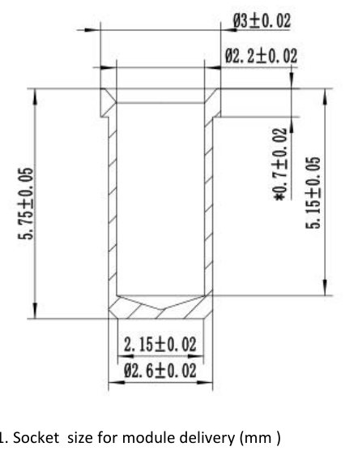
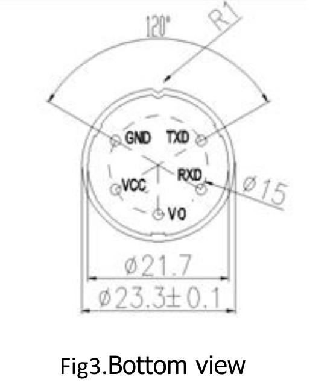

ZE-03 sensor KiCad files
========================

KiCad files for working with socketed ZE03 sensors from Winsen.

- symbol
- footprint (2.7mm and 2.8mm socket hole variants)
- breakout schema
- breakout PCB

**Disclaimer**: I have no idea what I'm doing. Use at your own risk.

Sensor info
===========

Socket:

Pins:

